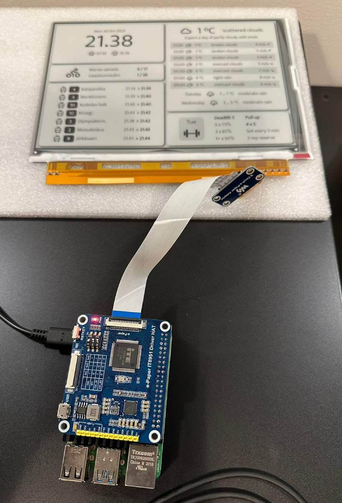

# Infoscreen

Infoscreen software, loads data from various sources, renders the display using headless Chrome and displays on e-Paper screen.

Runs on Raspberry Pi Zero 2 W and Waveshare display.



## Compilation

### BCM 2835 driver

[Download driver from here](https://www.airspayce.com/mikem/bcm2835/) and follow steps in "Running as root".

To compile it as `.so`, follow these steps.

```bash
# add library to ld
sudo ldconfig -n /usr/local/lib

# don't use make, instead compile bcm2835.c with these parameters
gcc -shared -DBCM2835_HAVE_LIBCAP -lcap -o libbcm2835.so -fPIC bcm2835.c

# "install"
sudo cp libbcm2835.so /usr/local/lib

# To allow specific program access to GPIO, run
sudo setcap cap_sys_rawio+ep path/to/executable
```

`infoscreen/run.sh` should take care of the rest.

## e-Paper info

* [Product page](https://www.waveshare.com/9.7inch-e-paper-hat.htm)
* [Wiki](https://www.waveshare.com/wiki/9.7inch_e-Paper_HAT)

## Contents

* `Player` - e-Paper driver control and bitmap display, based on [example from Waveshare](https://github.com/waveshareteam/IT8951-ePaper)
* `infoscreen` - Rust project
* `infoscreen/site` - static site used to render the view

## Notes

* `web_server` injects the data into the HTML by replacing `$DATA`
* New sources can be added by implementing trait `ApiQuery` (in `api.rs`) and adding it to `get_data` in `DataManager`
* static `DataManager` instance updates data from `ApiQuery`:ies. Their responses contain data and validity period, so bus stop info can be update every minute, but weather every 10 minutes etc.
* `main` runs update loop, in which headless Chrome loads data from application's web server and renders that as bitmap. This is then sent to the e-Paper driver for display.

## Data sources

The included data sources are:

* OpenWeatherMap (weather, sunrise, sunset)
* Digitransit (Helsinki area trams and city bikes)
* WodConnect (CrossFit gym programming)

## Config file

Use [Confy](https://docs.rs/confy/latest/confy/) default location, such as `~/.config/infoscreen/infoscreen.toml` on Linux.

```toml
# directory for headless Chrome profile etc., preferably ramdisk
work_directory = ''

# path to static website directory, "site" under this repo (without default document, index.html will be appended)
static_file_directory = ''

# ip address or hostname for web server
listen_address = ''

openweathermap_key = ''
digitransit_key = ''
digitransit_query_stops = 'HSL:1040480,HSL:1040481,HSL:1130439,HSL:1130438'
digitransit_query_bike_stations = '031,162'
wodconnect_cookie = ''
```